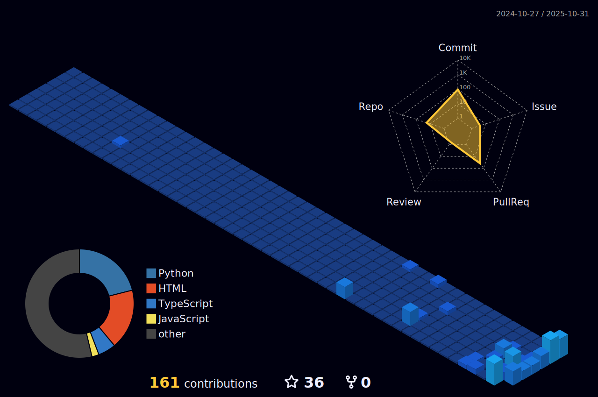

  

<h2 align="center">👋 Hi, I'm Raja Rathour </h2>

<b>Aspiring AI/ML Engineer | Intelligent Systems | Scalable ML Solutions | Active Learner | Problem Solving </b>

<!-- Animated Section Separator -->

<!-- 🌟 ABOUT ME SECTION -->

<table align="center" width="100%">
  <tr>
    <td width="60%" align="left" valign="top">

### 💫 About Me

-  Passionate about **building intelligent, data-driven systems** that solve real-world problems  
-  Currently exploring **Deep Learning**, **Computer Vision**, and **Generative AI**  
-  Interested in combining **Mathematics + Programming** to create meaningful innovation  
-  Always learning and focusing on **MLOps** and **scalable ML deployment**  
-  I love discussing **AI Ethics, Optimization, and Clean Architecture**  
-  Fun fact: I debug faster with music 🎧 

> “Don’t aim for success. Aim for excellence — success will follow.”

   </td>
   <td width="40%" align="center">
     
      
   </td>
  </tr>
</table>

---

---

## 🧠 Tech Stack & Skills

Core Technologies:

  
  
  
  
  

---

Machine Learning & Deep Learning:

  
  
  
  
  

---

## 🛠️ Detailed Skill Categories
**Machine Learning & Deep Learning**  
  
  
  
  

**Data Science & Analysis**  
  
  
  
  

**NLP**  
  
  
  
  

**Cloud & DevOps**  
  
  
  
  

**Web Development**  
  
  
  

**Version Control**  
  
  

  

## 🎓 Education
- **B.Tech in Mathematics and Computing (MCE)** – Delhi Technological University (DTU), *2028*

---

---
## 🏆 Hactoberfest Open-Source Badges

---

## 💡 Featured Projects

| Project | Description | Tech Stack | Demo/Repo |
| ------- | ----------- | ---------- | --------- |
| 🥗 **FoodVision-AI** | Deep learning app identifying 101 food categories from images. | PyTorch, Food-101, Vercel, HTML, JS | [💻 GitHub](https://github.com/Raja-89/FoodVision-AI)   |
| 📰 **Fake News Detector** | ML-based fake news detection with real-time results. | Python, NLP, TF-IDF, Logistic Regression, Streamlit | [💻 GitHub](https://github.com/Raja-89/fake-news-detector) |
| 🧩 **Tech Stack Tracker** | Web app for tracking and visualizing stacks. | JavaScript, HTML, CSS | [💻 GitHub](https://github.com/Raja-89/tech-stack-tracker) |

---

## 📊 GitHub Analytics (Live)

  

<!--

  

-->

## 🌐 Let's Connect!

  
  
  

---

  

